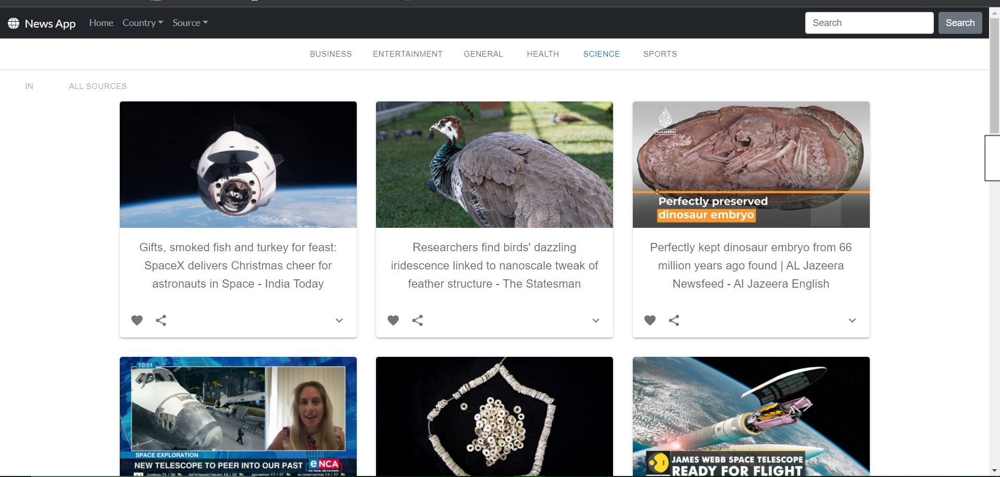
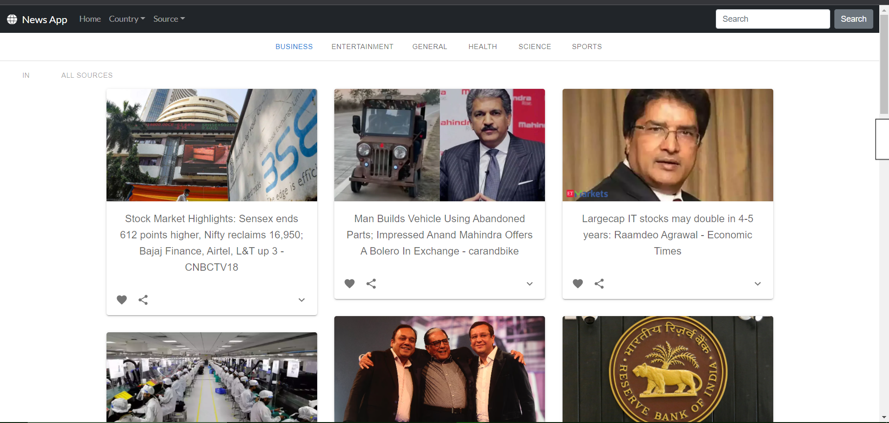

We have built this React News App which fetches news from all over the world from multiple sources using newsApi(https://newsapi.org/).

### Features:

1) Fetches news filtered by different categories, countries and sources

2) Search Feature that fetches news matching the keyword entered

3) Styled using react-bootstrap, Material-UI, semantic-UI and Masonry

### What we have learnt:

1) To create responsive web pages.

2) To use Rest API's to fetch data.

